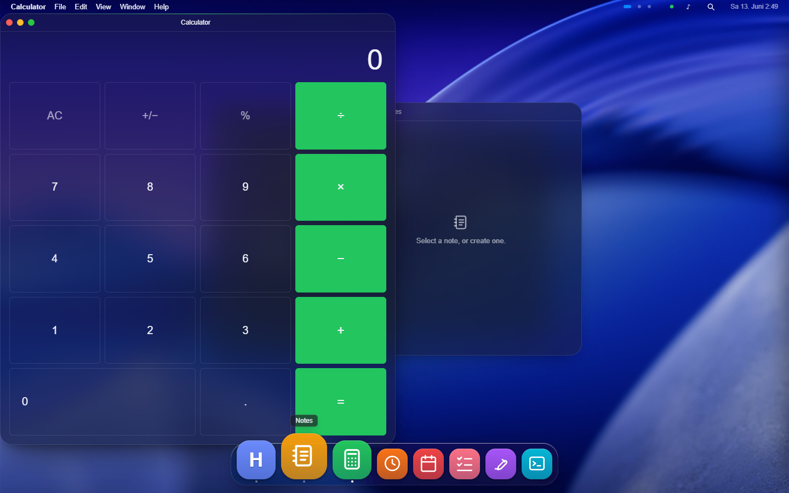
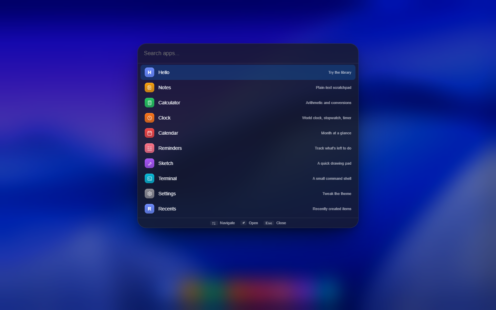
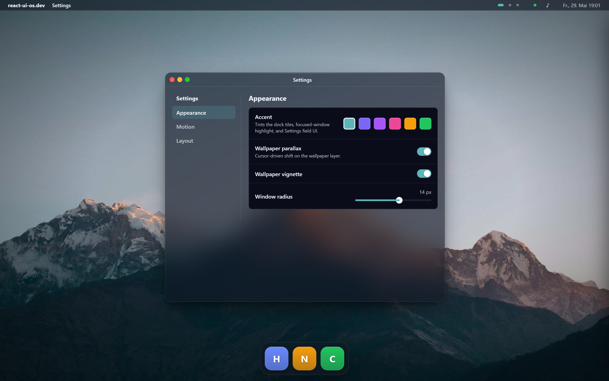
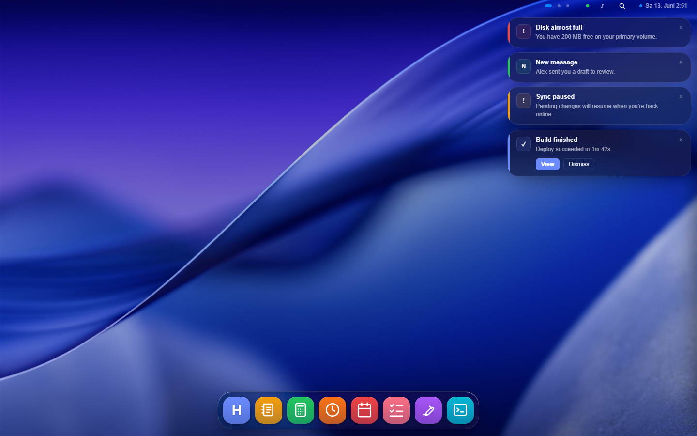
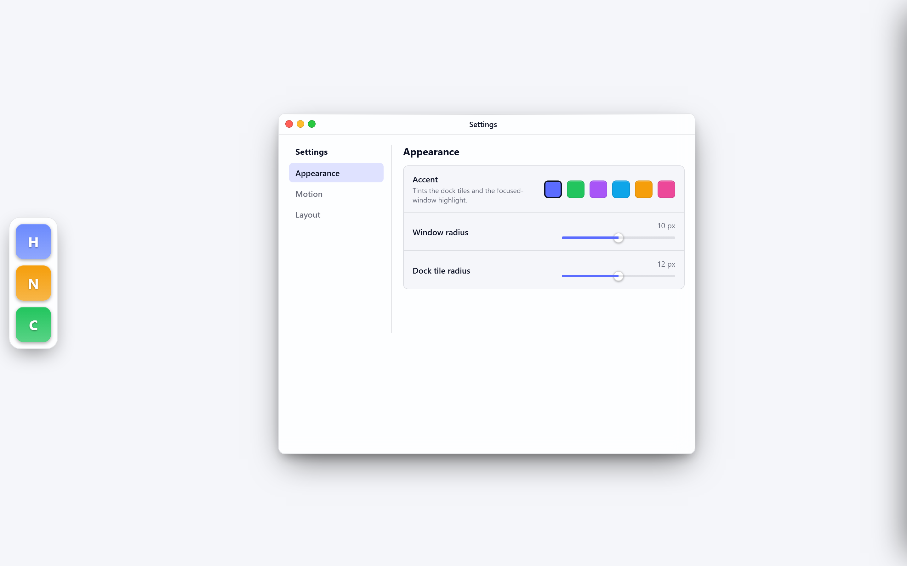

# react-ui-os

A working OS-style desktop for React. One tag renders the whole thing: wallpaper, dock, draggable resizable windows with traffic lights, focus tracking, Spotlight, Settings. You register apps as data; the library composes the system.

<p align="center">
  
</p>

<p align="center">
  <a href="https://saschb2b.github.io/react-ui-os/playground"><b>Try the playground</b></a>
  &nbsp;·&nbsp;
  <a href="https://saschb2b.github.io/react-ui-os/"><b>Read the docs</b></a>
</p>

## Install

```bash
pnpm add @react-ui-os/desktop @react-ui-os/theme-default
```

```tsx
import { Desktop } from "@react-ui-os/desktop";
import { defaultTheme } from "@react-ui-os/theme-default";

const apps = [{ id: "hello", name: "Hello", content: () => <h1>Hello, desktop.</h1> }];

<Desktop apps={apps} theme={defaultTheme} />;
```

That single tag produces the wallpaper, dock, draggable resizable windows, focus tracking, a minimize-to-dock genie animation, Spotlight (Cmd-K), and Settings (Cmd-,). Add an app to the registry and it shows up in the dock, the menu bar, Spotlight, and the keyboard shortcuts at once. No extra wiring.

## What you get

<table>
  <tr>
    <td width="50%"><br><b>Spotlight (Cmd-K)</b><br>Apps, system windows, and any source you register, searchable from one palette.</td>
    <td width="50%"><br><b>Settings (Cmd-,)</b><br>End users tweak whatever a theme marks <code>customizable</code>. No code on your side.</td>
  </tr>
  <tr>
    <td width="50%"><br><b>Notifications</b><br>Call <code>notify(...)</code> from anywhere. Toasts, dock badges, and a Notification Center, all wired.</td>
    <td width="50%"><br><b>Themes change the stance</b><br>Move the dock to the side, hide the menu bar, swap traffic lights for Windows controls.</td>
  </tr>
</table>

There is more in the box: workspaces, Mission Control, an app switcher (Cmd-Tab), window snapping, a Finder-style file explorer, and a context-menu system. See the [docs](https://saschb2b.github.io/react-ui-os/) for the full tour.

## App Store

Apps are not bundled into the library. Prebuilt ones live in a registry, and you copy the ones you want into your project with the [shadcn](https://ui.shadcn.com/docs/cli) CLI:

```bash
npx shadcn@latest add https://saschb2b.github.io/react-ui-os/r/notes.json
```

The files land in your codebase, so you own them and can edit them after install. Notes, Calculator, Clock, Calendar, Reminders, Sketch, and Terminal are in the registry today. Browse them in the [App Store](https://saschb2b.github.io/react-ui-os/app-store/), or [publish your own](https://saschb2b.github.io/react-ui-os/app-store/publish/) so others can install it.

## Why this exists

Most React UI libraries ship fifty components and let you wire them. That produces tidy webapps, not a coherent OS feeling, because nobody wants to wire fifty pieces into a desktop and keep them consistent. This library inverts the contract: you register apps; the library composes the system. The same `App` object lights up four surfaces, and a theme is pure data that decides how the whole thing reads.

## Packages

| Package                        | Purpose                                                                                                                                                                               |
| ------------------------------ | ------------------------------------------------------------------------------------------------------------------------------------------------------------------------------------- |
| `@react-ui-os/core`            | Pure logic. Window manager, app and theme types, storage adapter. No JSX.                                                                                                             |
| `@react-ui-os/desktop`         | The components. `<Desktop>`, `<DesktopProvider>`, `<Wallpaper>`, `<MenuBar>`, `<Dock>`, `<WindowLayer>`, `<Window>`, `<Spotlight>`, `<Settings>`, `<FileExplorer>`, `<DesktopIcons>`. |
| `@react-ui-os/theme-default`   | Unbranded baseline theme.                                                                                                                                                             |
| `@react-ui-os/theme-mintables` | Cinematic frosted-glass theme with parallax wallpaper, deep blur, teal accent.                                                                                                        |
| `@react-ui-os/theme-saas`      | Neutral light theme. Left dock, hidden menu bar, exercises the non-Mac chrome variants.                                                                                               |

All five packages ship dual ESM/CJS bundles + TypeScript declarations via `tsup`. Source-exported during in-repo development via a `source` Vite condition; consumers resolve through the bundled `dist/` output.

## Concepts

Three shapes carry the whole library. Each is plain data.

```tsx
import type { App } from "@react-ui-os/core";

// An App lights up the dock, menu bar, Spotlight, and keyboard shortcuts.
const notes: App = {
  id: "notes",
  name: "Notes",
  accent: "#f59e0b",
  content: ({ focused }) => <NotesEditor focused={focused} />,
};
```

- **Apps** are data. One object reaches four surfaces. ([docs](https://saschb2b.github.io/react-ui-os/quickstart/))
- **Themes** are token bags. `palette`, `shape`, `motion`, `blur`, `wallpaper`, and a `chrome` lever that moves the dock, hides the menu bar, or swaps the window controls. The library knows the metaphor; the theme dresses it. ([docs](https://saschb2b.github.io/react-ui-os/themes/overview/))
- **Storage** is swappable. Defaults to `localStorage`; pass your own adapter for server-backed or cross-device sync. ([docs](https://saschb2b.github.io/react-ui-os/api/storageadapter/))

The same primitives are reachable at three depths: `<Desktop>` for the full composition, `<DesktopProvider>` plus the surfaces you want, or the hooks (`useWindowManager`, `useTheme`, `useSettings`) to drive it from outside. The 80% case is one tag. The [docs](https://saschb2b.github.io/react-ui-os/) cover the rest.

## Development

```bash
pnpm install
pnpm dev                       # apps/playground at http://localhost:5173
pnpm --filter docs dev         # apps/docs (Starlight) at http://localhost:4321
pnpm typecheck                 # tsc across all packages
pnpm test                      # vitest across all packages
pnpm build                     # turbo build (produces dist/ for each package)
```

The repo is a `pnpm` + Turborepo monorepo. CI runs typecheck + test + build on every push (`.github/workflows/ci.yml`); the docs deploy to GitHub Pages from `main` (`.github/workflows/docs.yml`).

## Layout

```
react-ui-os/
  apps/
    docs/                        # Astro Starlight docs site
    playground/                  # Vite + React 19 dev playground
  packages/
    core/                        # @react-ui-os/core (window-manager, types, storage)
    desktop/                     # @react-ui-os/desktop (components)
    example-apps/                # @react-ui-os/example-apps (the registry's seed apps)
    theme-default/               # @react-ui-os/theme-default
    theme-mintables/             # @react-ui-os/theme-mintables
    theme-saas/                  # @react-ui-os/theme-saas
  .github/workflows/             # CI + Pages deploy
  registry.json                  # shadcn app registry (built and served by the docs site)
  CLAUDE.md                      # architecture and contribution rules
  DESIGN.md                      # visual direction and design tokens
```

## Support

- [Sponsor on Buy Me a Coffee](https://buymeacoffee.com/qohreuukw) keeps the lights on.
- [Open an issue](https://github.com/saschb2b/react-ui-os/issues) for bugs and feature requests.

## License

MIT. See [LICENSE](./LICENSE).
